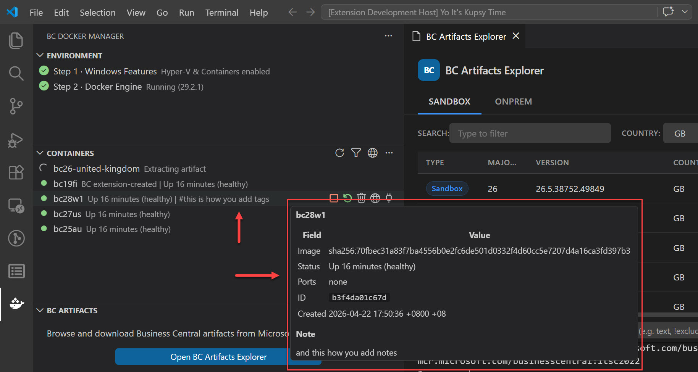
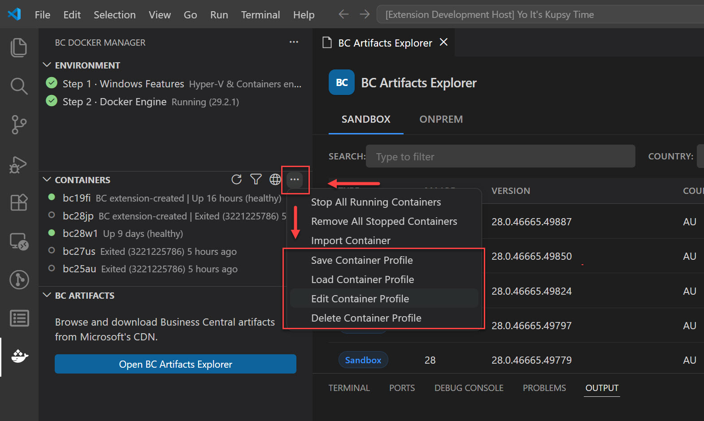

# Changelog

All notable changes to **BC Docker Manager** are documented here.

Format follows [Keep a Changelog](https://keepachangelog.com/en/1.1.0/).
Versions follow [Semantic Versioning](https://semver.org/).

---

## [1.5.3] - 2026-05-10

### Fixed

- License upload now works correctly across all supported container images. Certain container images load their administration tools differently from what the extension expected, which caused the upload to fail with a cryptic error or no message at all. The extension now uses a loading approach that works regardless of how the container image is structured internally.

- When you try to upload a license to a container that is not running, the error now clearly says "Container is not running. Start it and try again." instead of showing a raw exit code or an empty failure.

- Error messages from failed commands now include the full output from the operation, not just the error stream. Some container operations write important diagnostic information to the standard output rather than the error output. Both are now captured and shown in the output channel so you can see what actually happened.

---

## [1.5.2] - 2026-05-06

### Changed

- Docker Engine installation now downloads the installer using multiple parallel connections. Download time is significantly reduced on most network connections. If the server does not support parallel downloads, the extension falls back to a single connection automatically.

---

## [1.5.1] - 2026-05-03

### Changed

- Renamed the "What's New" command to "Show Release Notes" in the Command Palette for clarity. The setting description is updated to match.

- Improved reliability across the extension. Commands now recover from transient errors automatically. The output channel stays consistent throughout the extension lifetime. Addressed an issue where stale data could appear briefly in the sidebar after an update.

---

## [1.5.0] - 2026-05-01

### Highlights

- **Set Container Tags and Notes:** Attach tags and a free-text note to any container for at-a-glance organisation directly in the Containers panel.
- **Smarter container diagnostics:** When a container stops before BC is ready, the last 50 log lines appear immediately so you can see exactly what went wrong.
- **Safer container naming:** Uppercase letters are blocked at creation time to prevent DNS and SSL failures.
- **Release notes panel:** Release notes open automatically after each update. You can opt out via settings.

### Added

- Set Container Note command. Right-click any container in the Containers panel and choose "Set Container Note" to attach a free-text note to it. The note is shown at the bottom of the container tooltip and persists in VS Code global state, surviving container restarts, recreations, and VS Code restarts.

- Set Container Tags command. Right-click any container and choose "Set Container Tags" to attach one or more comma-separated tags (e.g. `client1, sandbox, v25`). Tags are shown as `#tag1 #tag2` appended to the container description line in the Containers panel so they are visible at a glance without hovering. Requested by [@omerfaruknav](https://github.com/omerfaruknav) in [#4](https://github.com/jeffreybulanadi/bc-docker-manager/issues/4).

- Clear Container Note and Tags command. Removes all annotations from a container in one step.

- Release notes panel. Opens automatically the first time VS Code starts after a new version is installed, showing a summary of changes for that version. The panel can be reopened any time via **BC Docker Manager: Show Release Notes** in the Command Palette. Set `bcDockerManager.showReleaseNotesOnUpdate` to `false` to disable the automatic opening.

### Changed

- Container export no longer fails when the container name contains uppercase letters. The name used internally during export is now sanitized before being passed to Docker. Reported by [@PJohnstonSysco](https://github.com/PJohnstonSysco) in [#8](https://github.com/jeffreybulanadi/bc-docker-manager/issues/8).

- Container IP detection now validates the result before using it, preventing malformed values from reaching networking setup. A fallback probe runs if the primary lookup returns nothing.

- Container name input now rejects uppercase letters at creation time. BC uses the container name as a DNS hostname and as the CN of its self-signed SSL certificate. Uppercase letters are not valid in hostnames per RFC 952 and 1123 and caused networking setup to fail silently. A warning is shown if the name contains underscores, which can also break certificate validation.

- When a container stops before BC finishes initializing, the last 50 lines of container logs appear in the output channel immediately. Common causes such as insufficient memory, a missing license, or an incompatible artifact are listed as a hint. Networking setup is skipped in this case to avoid a misleading "Cannot determine IP" error.

### Thank you

* [@PJohnstonSysco](https://github.com/PJohnstonSysco) - reported export failure with mixed-case container names ([#8](https://github.com/jeffreybulanadi/bc-docker-manager/issues/8))
* [@omerfaruknav](https://github.com/omerfaruknav) - requested container tags and notes ([#4](https://github.com/jeffreybulanadi/bc-docker-manager/issues/4))

---

## [1.4.0] - 2026-05-01

### Added

- Edit Container Profile command. Previously the only way to update a saved profile was to overwrite it by saving again with the same name, which required retyping every field from scratch. The new Edit command loads an existing profile into a step-by-step flow with each field pre-filled so you only change what you need. Isolation and authentication modes are shown as a pick list with the current value highlighted. Leaving country or license path empty clears those optional fields. Requested by [@thatnavguy](https://github.com/thatnavguy) in [#7](https://github.com/jeffreybulanadi/bc-docker-manager/issues/7).

- Delete Container Profile command is now visible in the Containers panel toolbar menu alongside Save, Load, and Edit. Previously it was only reachable via the command palette.

### Changed

- Load Container Profile now applies all stored values to VS Code settings immediately when you select a profile. Previously loading a profile had no visible effect. Country is only written when the profile includes one, to avoid clearing an existing preference unintentionally.

- File transfers between the host and containers are now significantly faster, particularly for Hyper-V containers. License upload, app publish, database backup, restore, and AL compilation all benefit. A 500 MB backup that previously took hours now completes in seconds. Reported by [@kennetlindberg](https://github.com/kennetlindberg) in [#6](https://github.com/jeffreybulanadi/bc-docker-manager/issues/6).

- SQL Server Express edition is now detected automatically before each backup. When Express is detected, the backup command is adjusted accordingly to prevent the failure that occurred on Express installations.

- Error messages no longer contain garbled characters from terminal color codes. These are now stripped before messages are shown in VS Code notifications and the output channel.

### Thank you

* [@kennetlindberg](https://github.com/kennetlindberg) - reported license upload and file transfer failure on Hyper-V containers ([#6](https://github.com/jeffreybulanadi/bc-docker-manager/issues/6))
* [@thatnavguy](https://github.com/thatnavguy) - requested the Edit Container Profile command ([#7](https://github.com/jeffreybulanadi/bc-docker-manager/issues/7))

---

## [1.3.1] - 2026-05-01

### Changed

- Changing country while a specific BC major version was selected now returns the correct results instead of showing 0 rows. If the selected major has no releases for the new country, the filter resets to show all versions automatically.
- Changing the artifact tab (Sandbox vs OnPrem) while a major version was selected could show 0 results. The major filter now resets when switching tabs.
- The country dropdown now restores the previously selected value when the list is refreshed.

---

## [1.3.0] - 2026-05-01

### Added
- Phase-aware progress during container initialization. The VS Code notification and the sidebar both show the current BC initialization phase (Downloading artifact, Installing prerequisites, Configuring SQL Server, Importing license, Installing Business Central, Ready) as the container starts up.
- Immediate sidebar placeholder. A spinning placeholder item appears the moment you start container creation, before Docker even reports the container exists. Previously the sidebar showed nothing for up to 5 minutes.
- Phase overlay on real containers. Once Docker reports the container, the placeholder is replaced by a real container item with the current phase shown as its description and a spinner icon. The icon and description clear automatically when the container is ready.
- Cancellation support. The initialization progress toast now has a Cancel button. Clicking it stops the health-check loop and removes the container with `docker rm -f`, then clears the sidebar placeholder. Previously there was no way to abort a stuck initialization.
- Completion toast with quick actions. When initialization finishes, a notification appears with two buttons: "Open BC Web Client" opens the BC login page directly, and "Generate launch.json" creates the AL project configuration.

### Changed
- Container initialization progress updates respond to state changes as they happen rather than on a fixed polling interval.

---

## [1.2.2] - 2026-04-30

### Changed
- Containers created via the extension were not visible when the BC filter was active if another labelled BC container was already running. Reported by [@omerfaruknav](https://github.com/omerfaruknav) in [#5](https://github.com/jeffreybulanadi/bc-docker-manager/issues/5), confirmed by [@kennetlindberg](https://github.com/kennetlindberg).
- The BC filter now correctly catches all BC containers regardless of when labels are applied.
- The container tree refreshes shortly after creation starts so the new container appears in the sidebar while BC is still initializing, not only after BC is fully ready.

### Thank you

* [@omerfaruknav](https://github.com/omerfaruknav) - reported containers not visible when the BC filter was active ([#5](https://github.com/jeffreybulanadi/bc-docker-manager/issues/5))
* [@kennetlindberg](https://github.com/kennetlindberg) - confirmed the BC filter issue ([#5](https://github.com/jeffreybulanadi/bc-docker-manager/issues/5))

---

## [1.2.1] - 2026-04-30

### Fixed
- Extension settings were ignored when creating containers. `defaultIsolation`, `defaultMemory`, and `defaultAuth` were hardcoded in the container creation flow, so containers always used `hyperv` isolation and `8G` memory regardless of what was configured. Reported by [@nunogsilva](https://github.com/nunogsilva) in [#3](https://github.com/jeffreybulanadi/bc-docker-manager/issues/3), confirmed by [@kennetlindberg](https://github.com/kennetlindberg).
- `defaultCountry` setting was ignored when opening the Artifacts Explorer. The panel always loaded `us` on open instead of the configured country. Also reported in [#3](https://github.com/jeffreybulanadi/bc-docker-manager/issues/3) by [@kennetlindberg](https://github.com/kennetlindberg).

### Thank you

* [@nunogsilva](https://github.com/nunogsilva) - reported that extension settings were ignored during container creation ([#3](https://github.com/jeffreybulanadi/bc-docker-manager/issues/3))
* [@kennetlindberg](https://github.com/kennetlindberg) - confirmed the isolation issue and reported the default country setting was also ignored ([#3](https://github.com/jeffreybulanadi/bc-docker-manager/issues/3))

---

## [1.2.0] - 2026-04-30

### Added
- **BC Artifacts sidebar section**: a dedicated "BC Artifacts" panel in the BC Docker Manager activity bar with a one-click *Open BC Artifacts Explorer* button. No more digging through the command palette.
- Globe and Refresh icon buttons in the BC Artifacts section title bar for quick access and panel reload.

### Improved
- Container tree refreshes are faster and more responsive. Results are served from cache on repeat reads and updated in the background automatically.
- Volume picker opens instantly on repeat access.
- NAV and BC container commands are routed correctly based on container type.
- Version list lookups are consolidated to reduce redundant network calls.
- Resources held by the extension are released properly when VS Code closes or the extension is deactivated.
- **Artifacts Explorer auto-open**: the panel now opens automatically only on first install, not on every VS Code launch.

---

## [1.1.0] - 2026-03-31

### Fixed
- Add BC User and Add Test Users commands failed with *New-NAVServerUser is not recognized*. NAV management module (`NavAdminTool.ps1`) is now imported before executing NAV cmdlets inside Docker containers.

---

## [1.0.13] - 2026-03-20

### Fixed
- Extension crashed on startup (*command not found: bcDockerManager.refreshEnvironment*) because `node_modules` was excluded from the VSIX. Removed `node_modules/**` from `.vscodeignore` so production dependencies are packaged correctly.
- Removed unused `sharp` dependency.

---

## [1.0.0] - 2026-02-01

### Added
- Initial public release.
- BC Artifacts Explorer webview: browse, filter, and pull BC container images.
- Container management tree view: start, stop, restart, and remove containers.
- Image management: pull BC images, pre-pull with progress, remove images.
- Volume management: create, remove, and inspect Docker volumes.
- Environment health panel: Hyper-V, Windows Containers, and Docker Engine status with one-click setup.
- AL developer tools: publish app, upload license, add users, backup/restore database, compile AL app, edit NST settings, view event log.
- `launch.json` generation, preview, and clipboard copy for AL projects.
- Container profiles: save and load container configurations.
- Bulk container operations: start all, stop all, remove all stopped.
- Azure Application Insights telemetry (opt-out via VS Code privacy settings).
