# BC Docker Manager

[](https://marketplace.visualstudio.com/items?itemName=jeffreybulanadi.bc-docker-manager)
[](https://marketplace.visualstudio.com/items?itemName=jeffreybulanadi.bc-docker-manager)
[](https://github.com/jeffreybulanadi/bc-docker-manager/actions/workflows/ci.yml)
[](LICENSE)

> Manage Business Central Docker containers from inside VS Code. Browse artifacts from the Microsoft CDN, create containers, develop AL apps, and keep your environment healthy -- all without installing BcContainerHelper or Docker Desktop.

> **Administrator required.** VS Code must be launched as Administrator. Some operations write to `C:\Windows\System32\drivers\etc\hosts`, install certificates into the Windows Trusted Root store, and interact with Windows optional features. These require elevation.

<!-- SCREENSHOT: Full VS Code window showing the BC Docker Manager sidebar (all sections expanded)
     with a running container visible and the Artifacts Explorer open in the editor area.
     Aim for 1280x800 or larger. Save as: screenshots/hero.png -->
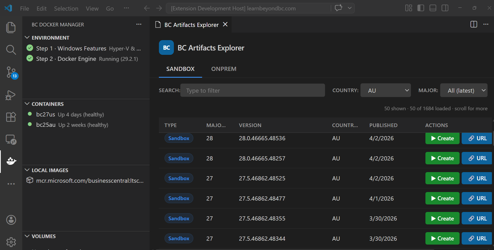

---

## Table of Contents

- [Why BC Docker Manager](#why-bc-docker-manager)
- [Getting Started](#getting-started)
  - [Prerequisites](#prerequisites)
  - [Quick Start](#quick-start)
  - [Your First Container](#your-first-container)
- [How It Works](#how-it-works)
- [Features](#features)
  - [BC Artifacts Explorer](#bc-artifacts-explorer)
  - [Container Management](#container-management)
  - [Container Annotations](#container-annotations)
  - [Environment Setup](#environment-setup)
  - [AL Development](#al-development)
  - [Networking and SSL](#networking-and-ssl)
  - [User Management](#user-management)
  - [Database Operations](#database-operations)
  - [Monitoring](#monitoring)
  - [Container Profiles and Bulk Operations](#container-profiles-and-bulk-operations)
  - [Images and Volumes](#images-and-volumes)
- [Configuration Reference](#configuration-reference)
  - [Isolation Modes](#isolation-modes)
  - [Authentication Modes](#authentication-modes)
- [Commands Reference](#commands-reference)
- [Troubleshooting](#troubleshooting)
- [Security and Permissions](#security-and-permissions)
- [What's New](#whats-new)
- [Contributing](#contributing)
- [Telemetry](#telemetry)
- [License](#license)

---

## Why BC Docker Manager

Business Central development on Windows typically requires either **BcContainerHelper** (a PowerShell module with many dependencies) or **Docker Desktop** (a paid product for most commercial teams). Both add significant overhead to a developer workstation.

BC Docker Manager takes a different approach. It calls the Docker Engine directly using the `docker` CLI, without going through BcContainerHelper or Docker Desktop's management layer. You get the same results with fewer moving parts.

**What you avoid:**
- Installing and maintaining the BcContainerHelper PowerShell module
- Paying for a Docker Desktop license for commercial use
- Running Docker Desktop's background services and extra memory overhead
- Writing PowerShell scripts for every routine container task

**What you get instead:**
- A VS Code sidebar that shows your containers, images, and volumes in real time
- A CDN browser that lists every published BC artifact -- sandbox and on-premises -- with filtering and sorting
- Container creation, networking, licensing, AL compilation, database backup, and more, all from the same panel
- Persistent tags and notes on containers so you always know which container is which
- Container profiles that save and restore full configurations

The extension is tested against Node.js 20 and 22 on every pull request. It has no runtime dependency on PowerShell modules outside the container itself.

---

## Getting Started

### Prerequisites

| Requirement | Minimum | Notes |
|-------------|---------|-------|
| Windows | Windows 10 build 1909 or Windows Server 2019 | Required for Windows Containers support |
| VS Code | 1.85.0 | [Download](https://code.visualstudio.com) |
| Hyper-V | Any | The extension can enable this for you. Requires a restart. |
| Docker Engine | Any current release | The extension can install this for you. Docker Desktop is not required. |

> **Windows Home users:** Hyper-V is not available on Windows Home editions. You need Windows 10 or 11 Pro, Enterprise, or Education -- or Windows Server.

### Quick Start

1. Install the extension from the [VS Code Marketplace](https://marketplace.visualstudio.com/items?itemName=jeffreybulanadi.bc-docker-manager).
2. Close VS Code, then reopen it as **Administrator** (right-click the VS Code shortcut and choose "Run as administrator").
3. Click the **BC Docker Manager** icon in the activity bar on the left side of VS Code.
4. Open the **Environment** panel. Click **Setup Everything** if any items show a problem.
5. Restart your machine if prompted. Hyper-V activation requires a restart.
6. Reopen VS Code as Administrator after the restart.
7. Open the **BC Artifacts** panel and click **Open BC Artifacts Explorer**.
8. Select a country, pick a BC version, and click **Create Container**.

### Your First Container

The container creation wizard collects four inputs:

1. **Container name** -- A short lowercase name, for example `bc25us`. The name becomes the container's DNS hostname and the CN of its SSL certificate. Uppercase letters are blocked. Underscores trigger a warning because they are not valid in DNS hostnames.
2. **Username** -- The BC administrator account. Default: `admin`.
3. **Password** -- The BC administrator password. BC enforces password complexity requirements.
4. **Accept EULA** -- You must agree to the Microsoft Business Central EULA.

After you confirm, the extension:
- Runs `docker run` with your chosen isolation mode, memory limit, and authentication settings
- Shows each initialization phase in the VS Code notification and sidebar: Downloading artifact, Installing prerequisites, Configuring SQL Server, Importing license, Installing Business Central, Ready
- Configures networking (hosts file and SSL certificate) automatically when BC becomes healthy
- Shows a completion notification with links to open the BC web client or generate `launch.json`

If something goes wrong, the last 50 log lines appear in the output channel immediately. Common causes are listed as a hint: not enough memory, missing license, or incompatible artifact.

You can cancel at any time using the **Cancel** button in the progress notification. The extension stops the health-check loop and removes the partially-created container.

---

## How It Works

BC Docker Manager is a VS Code extension written in TypeScript. It communicates with Docker by running the `docker` CLI directly -- the same commands you would type in a terminal. There is no custom daemon, no additional service, and no PowerShell module required on the host machine.

**Artifact browsing** fetches metadata from the Microsoft BC CDN (`bcartifacts.azureedge.net`) and caches it using a stale-while-revalidate (SWR) strategy. The list is shown immediately from cache while fresh data loads in the background. When the background fetch finishes and the data has changed, the view updates automatically. Cache entries expire after 10 seconds with a small random jitter to spread out concurrent requests.

**Container and image data** is also served from the SWR cache. The sidebar renders in under a millisecond from cache, then refreshes silently. The cache invalidates immediately after any create, start, stop, restart, or remove operation.

**File transfers** (license upload, AL app publish, database backup, database restore) use a single persistent `docker exec` process. The extension opens one long-running PowerShell session inside the container and streams data through a 48 KB sliding window, regardless of file size. An earlier design spawned a new process per 5-50 KB chunk. On a 500 MB database backup that was roughly 10,000 process starts at around 400 ms each -- hours instead of seconds.

**Docker CLI calls** that may fail transiently (network blips, Docker daemon startup) are retried with exponential backoff and full jitter. The maximum retry window is bounded to prevent a thundering-herd effect when multiple commands are issued at the same time.

**Logging** goes through a shared structured logger. Every message is timestamped and tagged with a severity level (debug, info, warn, error). Error-level messages are forwarded to telemetry automatically. The `BC Docker Manager` output channel is the same channel throughout the extension lifetime.

---

## Features

### BC Artifacts Explorer

Browse every Business Central artifact published to the Microsoft CDN without leaving VS Code.

<!-- SCREENSHOT: The Artifacts Explorer webview with the SANDBOX tab active,
     a country selected (e.g. "us"), and the table populated with artifact rows.
     Show the search bar, country dropdown, and version dropdown at the top.
     Save as: screenshots/artifacts-explorer.png -->
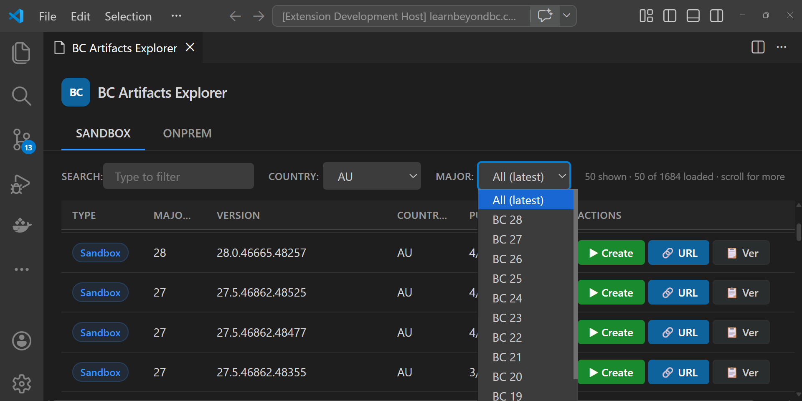

- **Two artifact types** -- Switch between Sandbox and OnPrem using the tabs at the top.
- **Filter by country** -- Select from the full list of country codes (`us`, `w1`, `de`, `dk`, `nl`, `fr`, `gb`, and more).
- **Filter by major version** -- Narrow down to a specific BC major release.
- **Free-text search** -- Type any part of a version string or date to filter inline.
- **Sortable columns** -- Click any column header to sort by version, country, or date.
- **Infinite scroll** -- More rows load automatically as you scroll down.
- **One-click actions** -- Copy the version string, copy the full CDN URL, or start container creation.
- **CDN health check** -- Run **Test BC Artifacts CDN Connection** from the command palette to verify your network can reach the CDN.

#### Container Creation Wizard

Click **Create Container** on any artifact row to open the guided wizard. After you complete the four inputs, the extension runs everything automatically with real-time progress shown in the notification area and the sidebar.

<!-- SCREENSHOT: The VS Code notification area showing container creation progress,
     e.g. "Pulling image..." or "Container bc25us is ready!" with the output channel visible below.
     Save as: screenshots/container-creation.png -->
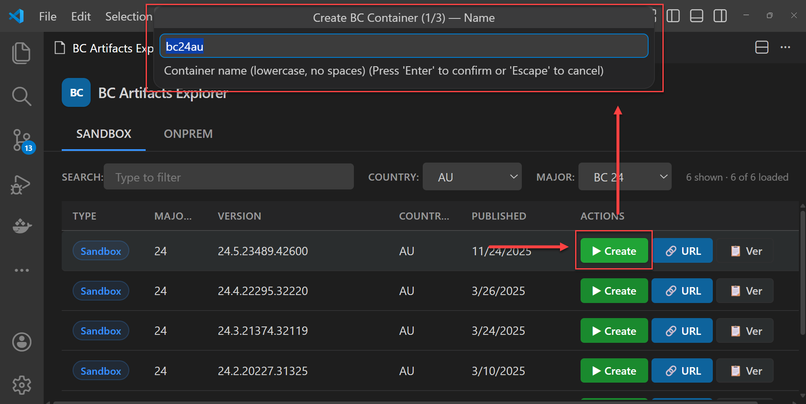

---

### Container Management

All your containers are listed in the **Containers** sidebar panel. Running containers show a green icon; stopped containers show a gray icon. Phase descriptions and spinner icons appear while a container is initializing.

<!-- SCREENSHOT: The Containers sidebar section with at least one running container and one stopped container visible.
     Show the inline action buttons (stop, restart, remove, web client, networking) on the running container.
     Save as: screenshots/containers-panel.png -->
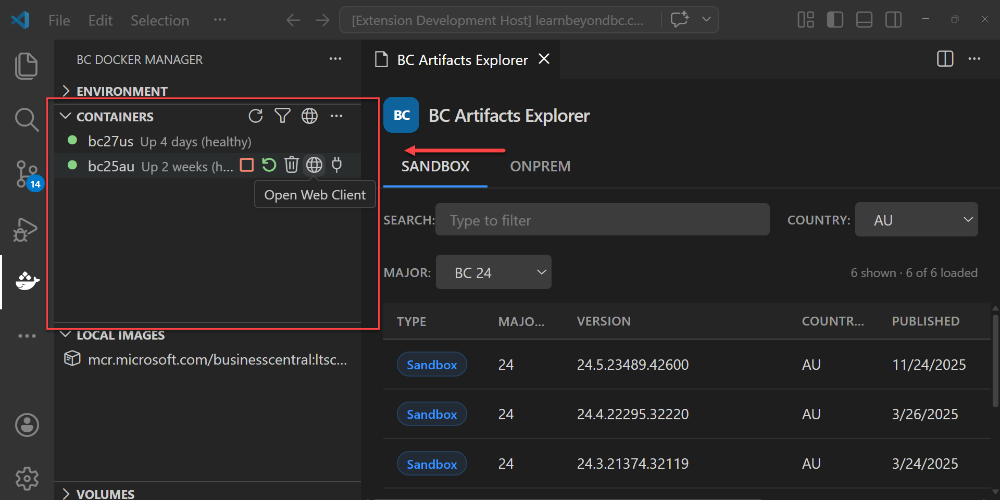

#### Lifecycle Actions

| Action | How to trigger |
|--------|----------------|
| Start | Click the play button on a stopped container, or right-click > Start Container |
| Stop | Click the stop button on a running container, or right-click > Stop Container |
| Restart | Right-click > Restart Container |
| Remove | Click the trash button, or right-click > Remove Container |
| Export | Right-click > Export Container -- saves the container as a `.tar` file |
| Import | Use the toolbar menu at the top of the Containers panel to import a `.tar` file |

#### Quick Access

Click the inline icons on any running container:

- **Open Web Client** -- opens `https://<containername>/BC/` in your browser. Networking (hosts file and SSL certificate) is configured automatically before the browser opens if it has not been set up yet.
- **Open Terminal** -- opens an interactive PowerShell session inside the running container.
- **View Logs** -- streams `docker logs --follow` in a VS Code terminal, showing new log lines as they arrive.
- **Copy IP** -- copies the container's current IP address to your clipboard.
- **Show Stats** -- opens a live statistics view that updates every 5 seconds.

#### Context Menu

Right-click any container to see the full action menu, organized into groups:

<!-- SCREENSHOT: Right-click context menu on a running container showing all menu groups:
     Container actions, Connection, BC Operations, BC Data, BC Pro Features, Advanced.
     Save as: screenshots/container-context-menu.png -->
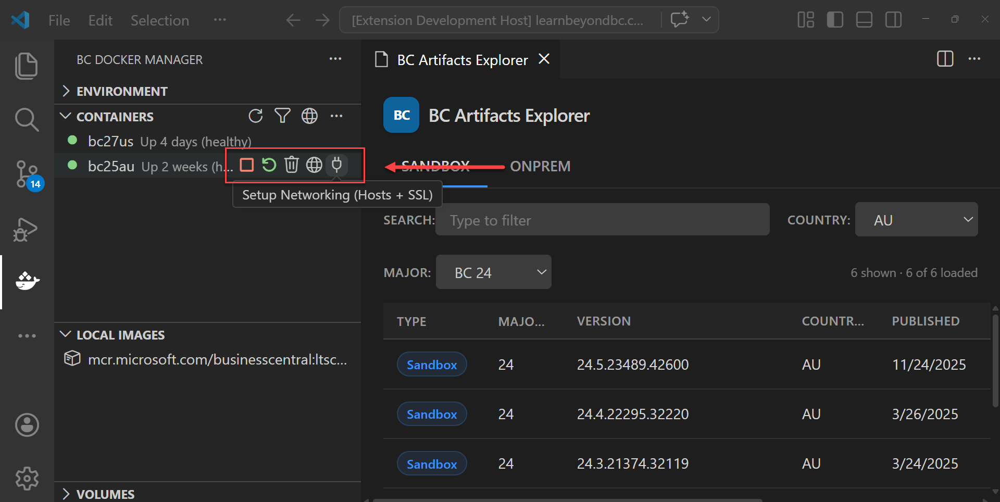

| Group | Actions |
|-------|---------|
| Container | Start, Stop, Restart, Remove, Export |
| Connection | Open Web Client, Open Terminal, View Logs, Copy IP, Setup Networking |
| BC Operations | Generate launch.json, Add BC User, Add Test Users, Upload License, Install Test Toolkit, Edit NST Settings |
| BC Data | Backup Database, Restore Database |
| Monitoring | Show Container Stats, View Event Log |
| Annotations | Set Container Tags, Set Container Note, Clear Container Note and Tags |
| Profiles | Save Container Profile, Load Container Profile |

---

### Container Annotations

Attach tags and notes to any container to keep track of what each one is for. Annotations are stored in VS Code global state and survive container restarts, recreations, and VS Code restarts. They do not depend on Docker labels or container metadata.

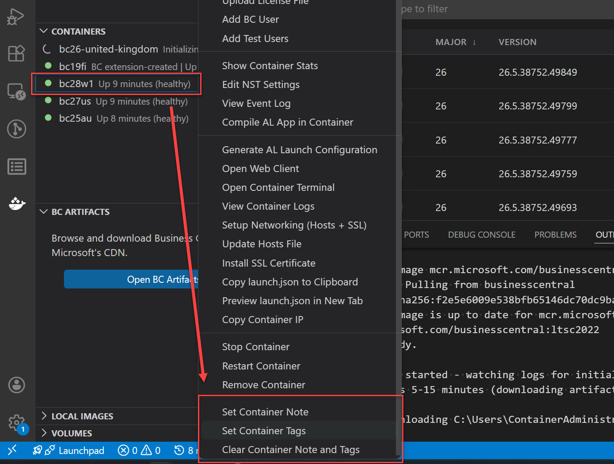

#### Tags

Right-click any container and choose **Set Container Tags**. Enter a comma-separated list of labels, for example: `client1, sandbox, v25`.

Tags appear inline in the container list as `#client1 #sandbox #v25` so you can identify containers at a glance without hovering.

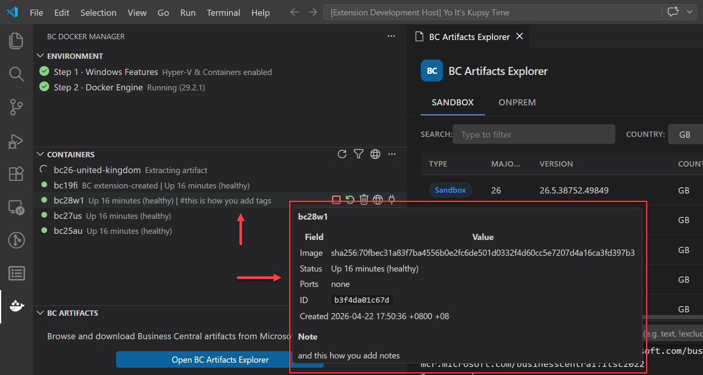

#### Notes

Right-click any container and choose **Set Container Note**. Enter any free-text note, for example: `Client demo - do not remove` or `Restore from backup 2026-04-30`.

The note appears at the bottom of the container tooltip when you hover over the container name in the sidebar.

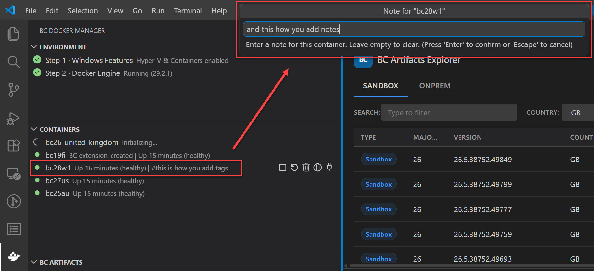

#### Clearing Annotations

Right-click the container and choose **Clear Container Note and Tags** to remove all annotations in one step.

| Command | What it does |
|---------|-------------|
| Set Container Tags | Attach comma-separated tags to a container |
| Set Container Note | Attach a free-text note to a container |
| Clear Container Note and Tags | Remove all annotations from a container |

---

### Environment Setup

The **Environment** panel checks your system before you start and tells you exactly what is missing. You do not need to run any manual setup commands.

<!-- SCREENSHOT: The Environment sidebar section expanded, showing health check items.
     Ideally show a mix of statuses: green for items that pass, red or yellow for items that need attention.
     The "Setup Everything" rocket icon should be visible in the section toolbar.
     Save as: screenshots/environment-panel.png -->
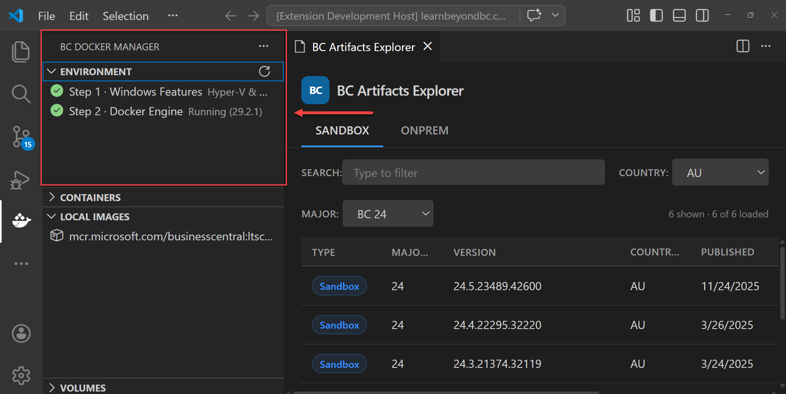

**Health checks run every 15 seconds:**

| Check | What it verifies |
|-------|-----------------|
| Windows Features | Hyper-V and Windows Containers are both enabled |
| Docker Engine | The Docker service is installed and running |

**One-click fixes:**

| Button | What it does |
|--------|-------------|
| Setup Everything | Runs all fixes in the correct order in a single step |
| Enable Hyper-V and Windows Containers | Runs `Enable-WindowsOptionalFeature -FeatureName Hyper-V, Containers` -- requires a restart |
| Install Docker Engine | Downloads the standalone Docker Engine from `download.docker.com` and installs it as a Windows service. Docker Desktop is not required. |
| Start Docker Engine | Starts the `docker` Windows service if it is installed but stopped |

> After **Enable Hyper-V and Windows Containers** runs, restart your machine. Reopen VS Code as Administrator after the restart. The Environment panel will then show green.

---

### AL Development

BC Docker Manager works alongside the [AL Language extension](https://marketplace.visualstudio.com/items?itemName=ms-dynamics-smb.al) to speed up AL development. You do not need `alc.exe` installed on your host machine -- the extension uses the copy inside the container.

#### Generate launch.json

The `launch.json` file connects the AL Language extension to a running BC container. BC Docker Manager generates this file for you:

| Command | What it does |
|---------|-------------|
| Generate AL Launch Configuration | Writes `.vscode/launch.json` to your workspace root |
| Preview launch.json in New Tab | Opens the generated config in a read-only editor tab for review |
| Copy launch.json to Clipboard | Copies the JSON to your clipboard for manual pasting |

Right-click a running container and choose **Generate AL Launch Configuration**. The file is written to the workspace that is currently open in VS Code. If no workspace is open, you will be asked to select a folder.

#### Compile AL App

Compile your AL project using `alc.exe` inside the container:

1. Right-click a running container and choose **Compile AL App in Container**.
2. Select your AL workspace folder.
3. The extension copies your source files into the container, runs `alc.exe`, and copies the compiled `output.app` back to your workspace root.

No AL compiler installation is required on your machine. The container already includes the correct version of `alc.exe` for the BC release it is running.

#### Publish AL App

Deploy a compiled `.app` file directly to a container:

1. Right-click a running container and choose **Publish AL App to Container**.
2. Select your `.app` file.
3. The extension runs Publish, Sync, and Install in sequence automatically.

---

### Networking and SSL

BC containers use custom hostnames and self-signed SSL certificates. Browsers reject self-signed certificates by default, and the container hostname does not resolve until it is added to your hosts file. The extension handles both.

| Command | What it does |
|---------|-------------|
| Setup Networking | Updates the hosts file and installs the SSL certificate in one step |
| Update Hosts File | Adds or updates the container hostname-to-IP mapping in `C:\Windows\System32\drivers\etc\hosts` |
| Install SSL Certificate | Extracts the container's certificate and adds it to the Windows Trusted Root Certification Authorities store |

**Automatic setup:** When you click **Open Web Client**, the extension checks whether networking has already been configured for that container. If not, it runs **Setup Networking** before opening the browser.

**After a container restart:** Container IP addresses are assigned by Docker on each start. If you restart a container, its IP may change. Run **Update Hosts File** or **Setup Networking** to refresh the mapping.

**IP detection:** The extension probes the `nat` network (Windows containers) and the `bridge` network (Linux containers), validates the result as a well-formed IPv4 address, then falls back to a range-based probe if both networks return nothing. This prevents Docker daemon warning strings from being treated as IP addresses.

---

### User Management

Create BC users inside a running container without opening the web client or writing PowerShell.

| Command | What it does |
|---------|-------------|
| Add BC User | Create a single user with a custom name, password, and permission set |
| Add Test Users | Create three standard test users with a single click |

**Standard test users created by Add Test Users:**

| Username | Permission Set | Password |
|----------|---------------|----------|
| ESSENTIAL | SUPER | P@ssw0rd |
| PREMIUM | SUPER | P@ssw0rd |
| TEAMMEMBER | D365 TEAM MEMBER | P@ssw0rd |

---

### Database Operations

Backup and restore run through a single persistent streaming connection to the container. There is no temporary file staging on the host; data flows directly through the `docker exec` channel.

| Command | What it does |
|---------|-------------|
| Backup Database | Creates a `.bak` file inside the container using SQL Server's `BACKUP DATABASE` command, then copies it to a path you choose on your machine |
| Restore Database | Copies a `.bak` file from your machine into the container, stops the BC service tier, restores the database, and restarts the service tier |

**SQL Server Express detection:** Before each backup, the extension checks the SQL Server edition. If Express is detected, it omits the `COMPRESSION` option. SQL Server Express does not support backup compression; including it causes the command to fail with an error.

**Hyper-V containers:** All file transfers go through one long-lived `docker exec` process with a 48 KB sliding window. A 500 MB backup that previously took hours now completes in seconds.

---

### Monitoring

| Command | What it does |
|---------|-------------|
| Show Container Stats | Opens a live panel showing CPU, memory, network I/O, and block I/O. Updates every 5 seconds. |
| View Container Logs | Opens a terminal and streams `docker logs --follow` in real time |
| View Event Log | Retrieves recent Windows Event Log entries from the MicrosoftDynamicsNavServer and MSSQL sources inside the container |
| Edit NST Settings | Opens the NavServerTier configuration file for the container's BC service tier. You can edit values and optionally restart the service to apply changes. |

**Container exit diagnostics:** If a container stops before BC finishes initializing, the last 50 log lines appear in the output channel immediately. Common causes are listed as a hint: not enough memory, missing license, or incompatible artifact. Networking setup is skipped in this case to avoid misleading error messages.

---

### Container Profiles and Bulk Operations

#### Profiles

A profile saves a full container configuration (memory limit, isolation mode, authentication, DNS, country, and license path) to VS Code user settings under a name you choose. You can recall it later to reproduce the same container on a different machine or after a clean install.

<!-- SCREENSHOT: Containers panel ... menu open showing Save, Load, Edit, Delete Container Profile.
     Save as: screenshots/profiles/profile-menus.jpg -->
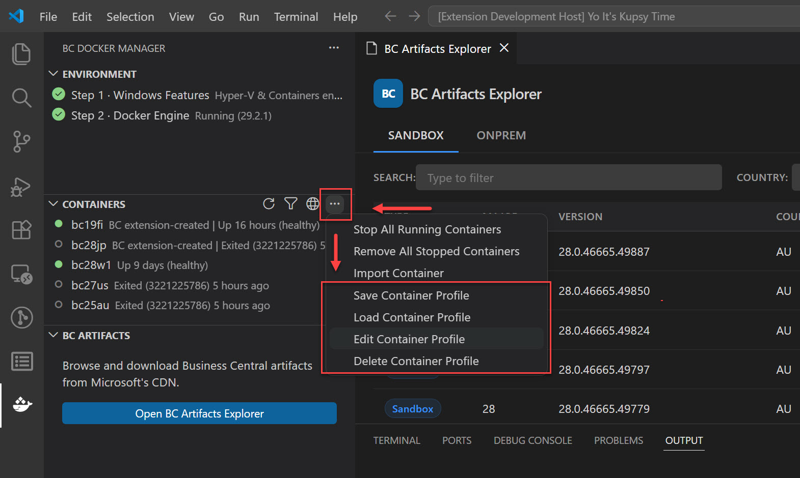

| Command | What it does |
|---------|-------------|
| Save Container Profile | Saves your current BC Docker Manager settings to a named profile |
| Load Container Profile | Applies a saved profile, writing all values to your VS Code user settings immediately |
| Edit Container Profile | Loads a saved profile into the step-by-step wizard with every field pre-filled |
| Delete Container Profile | Removes a saved profile |

When you load a profile, your VS Code user settings are updated immediately. The next container you create picks up those values automatically. Country is only written if the profile includes one, to avoid clearing an existing country preference unintentionally.

When you edit a profile, each field is pre-filled with the saved value. Isolation and authentication modes appear as a pick list with the current profile value highlighted. You only change what you need.

<!-- SCREENSHOT: Load Container Profile quick pick showing profile name and details.
     Save as: screenshots/profiles/load-profile.jpg -->
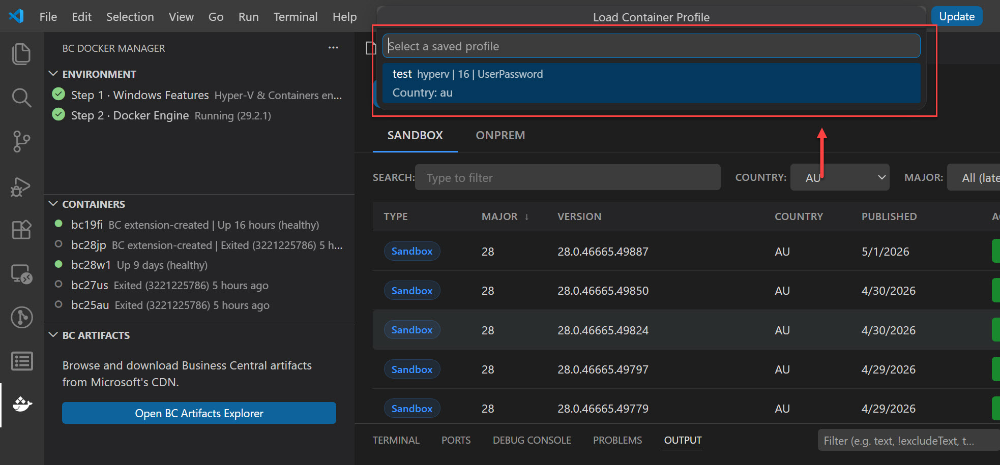

<!-- SCREENSHOT: VS Code Settings panel showing BC Docker Manager settings updated after load.
     Save as: screenshots/profiles/profile-overwrites-user-settings-on-the-fly.jpg -->
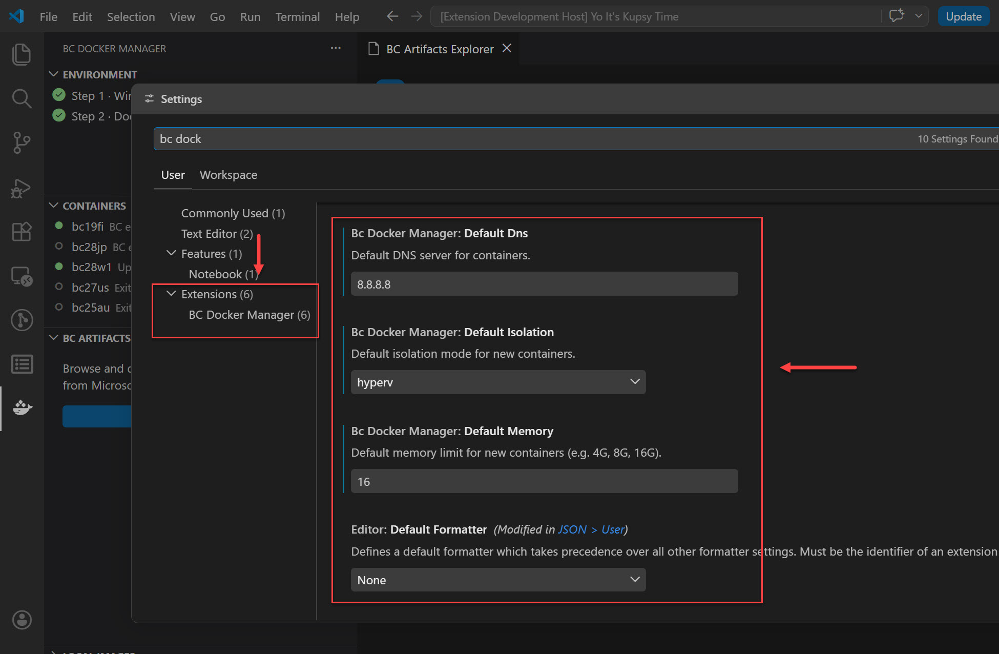

#### Bulk Operations

| Command | What it does |
|---------|-------------|
| Start All Stopped Containers | Starts every stopped container in parallel |
| Stop All Running Containers | Stops every running container in parallel |
| Remove All Stopped Containers | Removes every stopped container in parallel |

All bulk operations run in parallel. They do not wait for one container to finish before starting the next.

---

### Images and Volumes

#### Local Images

<!-- SCREENSHOT: The Local Images sidebar section showing one or more BC images.
     The filter toggle icon should be visible in the toolbar.
     Save as: screenshots/images-panel.png -->
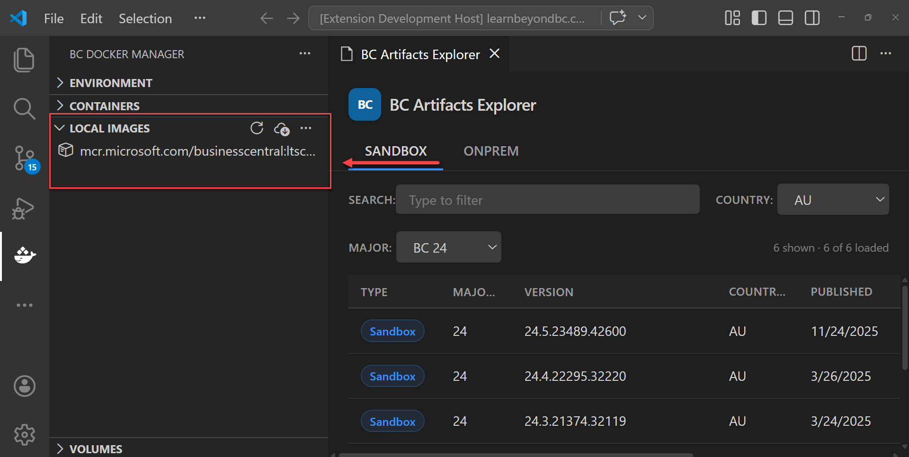

The **Local Images** panel lists all Docker images on your machine. Use the **Toggle BC Filter** button in the toolbar to show only Business Central images (those from `mcr.microsoft.com/businesscentral`).

| Command | What it does |
|---------|-------------|
| Pre-Pull BC Image | Downloads `mcr.microsoft.com/businesscentral:ltsc2022` in the background. Run this while you have a good connection to avoid waiting during container creation. |
| Remove Image | Removes a local Docker image |

#### Volumes

The **Volumes** panel lists all Docker volumes on your machine.

| Command | What it does |
|---------|-------------|
| Create Volume | Creates a new Docker volume with a name you provide |
| Inspect Volume | Shows the driver and mountpoint for a volume |
| Remove Volume | Removes a Docker volume |

---

## Configuration Reference

Open **Settings > Extensions > BC Docker Manager** to configure defaults. All settings affect new containers; they do not change containers that already exist.

| Setting | Type | Default | Description |
|---------|------|---------|-------------|
| `bcDockerManager.defaultMemory` | string | `8G` | Memory limit for new containers. Accepts a number followed by a unit: `512M`, `4G`, `16G`. BC requires at least 4 GB to start. 8 GB is recommended for development. |
| `bcDockerManager.defaultIsolation` | string | `hyperv` | Isolation mode for new containers. See [Isolation Modes](#isolation-modes). |
| `bcDockerManager.defaultAuth` | string | `UserPassword` | Authentication type for new containers. See [Authentication Modes](#authentication-modes). |
| `bcDockerManager.defaultCountry` | string | `us` | Country code used when the Artifacts Explorer opens. Common values: `us`, `w1`, `de`, `dk`, `nl`, `fr`, `gb`. |
| `bcDockerManager.defaultDns` | string | `8.8.8.8` | DNS server for new containers. Use your corporate DNS if containers need to reach internal resources. |
| `bcDockerManager.defaultArtifactType` | string | `sandbox` | Default artifact type when the Artifacts Explorer opens: `sandbox` or `onprem`. |
| `bcDockerManager.showReleaseNotesOnUpdate` | boolean | `true` | When `true`, the release notes panel opens automatically the first time VS Code starts after a new version is installed. Set to `false` to disable. |

### Isolation Modes

| Mode | Description | When to use |
|------|-------------|-------------|
| `hyperv` | Each container runs inside a dedicated Hyper-V virtual machine with its own isolated kernel. | Use on Windows 10 or 11. Process isolation is not supported on client OS versions. Also use when security isolation between containers matters. |
| `process` | Container processes share the host OS kernel directly. No Hyper-V VM is created. | Use on Windows Server only. Requires the host OS build to exactly match the container image OS build. Starts faster and uses less memory than Hyper-V. |

> **On Windows 10 or 11, always use `hyperv`.** Process isolation requires Windows Server and an exact OS build match between the host and the container image.

### Authentication Modes

| Mode | Description | When to use |
|------|-------------|-------------|
| `UserPassword` | BC manages usernames and passwords independently of Windows. Users authenticate with a BC-specific username and password. | Use for most development scenarios. Simple to set up. Works on any machine without domain configuration. |
| `NavUserPassword` | NAV-style authentication using a BC username and a password hash stored in the NAV user table. | Use when connecting to older NAV or BC versions that require NavUserPassword, or when following scripts that specify this mode. |
| `Windows` | BC accepts the Windows identity of the currently logged-in user. No BC-specific password is required. | Use when the container is joined to a domain and you want single sign-on from Windows. Requires additional domain configuration. |

---

## Commands Reference

All commands are available from the Command Palette (`Ctrl+Shift+P`) under the **BC Docker Manager** prefix.

<!-- SCREENSHOT: Command Palette open with "BC Docker Manager" typed, showing the full list of commands.
     Save as: screenshots/command-palette.png -->
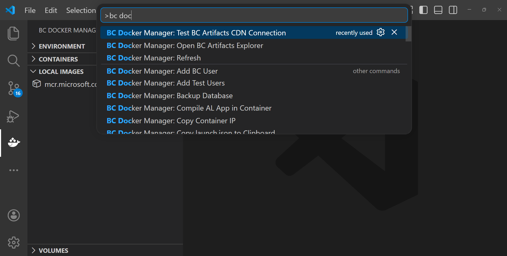

<details>
<summary><b>Full command reference (click to expand)</b></summary>

### Environment and Setup

| Command | Description |
|---------|-------------|
| Refresh | Refresh all containers, images, and volumes |
| Setup Everything | One-click environment setup (Hyper-V and Docker) |
| Enable Hyper-V and Windows Containers | Enable required Windows features. Requires a restart. |
| Install Docker Engine | Download and install the standalone Docker Engine |
| Start Docker Engine | Start the Docker Windows service |
| Refresh Environment Status | Re-run all environment health checks immediately |

### Artifacts

| Command | Description |
|---------|-------------|
| Open BC Artifacts Explorer | Open the CDN browser |
| Test BC Artifacts CDN Connection | Verify that the CDN is reachable from your machine |

### Container Lifecycle

| Command | Description |
|---------|-------------|
| Start Container | Start a stopped container |
| Stop Container | Stop a running container |
| Restart Container | Restart a running container |
| Remove Container | Delete a container |
| Export Container | Save a container as a `.tar` image file |
| Import Container | Load a container from a `.tar` file |
| Start All Stopped Containers | Start every stopped container in parallel |
| Stop All Running Containers | Stop every running container in parallel |
| Remove All Stopped Containers | Remove every stopped container in parallel |
| Toggle BC Filter | Switch between showing all containers and images, or only BC ones |

### Connection and Networking

| Command | Description |
|---------|-------------|
| Open Web Client | Open the BC web client in your browser. Configures networking automatically if needed. |
| Open Container Terminal | Open a PowerShell session inside the container |
| View Container Logs | Stream container logs in a terminal |
| Copy Container IP | Copy the container's current IP address |
| Setup Networking | Update the hosts file and install the SSL certificate |
| Update Hosts File | Map the container hostname to its current IP |
| Install SSL Certificate | Add the container's certificate to Windows Trusted Root |

### AL Development

| Command | Description |
|---------|-------------|
| Generate AL Launch Configuration | Write `.vscode/launch.json` to the current workspace |
| Preview launch.json in New Tab | Open the generated config for review |
| Copy launch.json to Clipboard | Copy the generated config to your clipboard |
| Compile AL App in Container | Compile your AL project using `alc.exe` inside the container |
| Publish AL App to Container | Publish, sync, and install a `.app` file |

### BC Operations

| Command | Description |
|---------|-------------|
| Upload License File | Import a `.flf` or `.bclicense` file into the container |
| Add BC User | Create a user with a custom name, password, and permission set |
| Add Test Users | Create three standard test users |
| Backup Database | Create a `.bak` backup via SQL Server |
| Restore Database | Restore from a `.bak` file |
| Install Test Toolkit | Install the BC test framework or full test toolkit |
| Edit NST Settings | View and edit NavServerTier configuration |
| View Event Log | Retrieve recent Windows Event Log entries from inside the container |
| Show Container Stats | Open the live resource monitoring panel |

### Container Profiles

| Command | Description |
|---------|-------------|
| Save Container Profile | Save current configuration settings to a named profile |
| Load Container Profile | Apply a saved profile to your VS Code settings |
| Edit Container Profile | Update a saved profile with fields pre-filled |
| Delete Container Profile | Remove a saved profile |

### Container Annotations

| Command | Description |
|---------|-------------|
| Set Container Tags | Attach comma-separated tags to a container |
| Set Container Note | Attach a free-text note to a container |
| Clear Container Note and Tags | Remove all annotations from a container |

### General

| Command | Description |
|---------|-------------|
| Show Release Notes | Open the release notes panel for the current version |

### Volumes

| Command | Description |
|---------|-------------|
| Create Volume | Create a new Docker volume |
| Inspect Volume | View volume details |
| Remove Volume | Delete a Docker volume |

### Images

| Command | Description |
|---------|-------------|
| Pre-Pull BC Image | Download the base BC image in the background |
| Remove Image | Delete a local Docker image |

</details>

---

## Troubleshooting

### VS Code reports a command was not found

**Symptom:** A notification appears saying `command 'bcDockerManager.X' not found`.

**Cause:** The extension did not activate correctly, or it crashed during startup.

**Steps:**
1. Open the Output panel (`View > Output`) and select **BC Docker Manager** from the dropdown.
2. Look for any error message near the top of the log.
3. Reload VS Code (`Ctrl+Shift+P` > **Developer: Reload Window**).
4. If the error returns, confirm that VS Code is running as Administrator.
5. If the problem persists, open **Extensions** in the sidebar, find **BC Docker Manager**, click **Disable**, then **Enable**.

---

### The container list is empty after creating a container

**Symptom:** You started container creation but the new container does not appear in the sidebar.

**Cause:** The BC filter may be active. New containers do not carry BC labels until BC initialization finishes.

**Steps:**
1. Click **Toggle BC Filter** in the Containers panel toolbar to show all containers.
2. If the container appears with the filter off, wait for BC to finish initializing. The container will appear in the filtered view once BC is ready.
3. If the container does not appear at all, check the output channel for error messages.

---

### Container creation fails or exits before BC is ready

**Symptom:** The progress notification disappears or shows an error before BC reports as ready.

| Cause | Resolution |
|-------|-----------|
| Not enough memory | Increase `bcDockerManager.defaultMemory` to `8G` or higher. BC requires at least 4 GB. |
| Missing or invalid license | Upload a valid `.flf` or `.bclicense` file using **Upload License File** after the container starts. |
| Incompatible artifact | Try a different BC version. Some older artifacts may not be compatible with the current base image. |
| Docker daemon not running | Open the **Environment** panel and click **Start Docker Engine**. |
| Not enough disk space | BC images are 10-20 GB. Ensure you have at least 30 GB free before creating a container. |

The output channel always shows the last 50 log lines when a container exits unexpectedly. Check there first.

---

### The BC web client shows a certificate error

**Symptom:** The browser shows "Your connection is not private" or a similar certificate warning.

**Cause:** The SSL certificate for the container has not been installed in Windows Trusted Root, or the hosts file entry is stale.

**Steps:**
1. Right-click the container and choose **Setup Networking**. This updates the hosts file and installs the certificate in one step.
2. Close and reopen the browser tab.
3. If the error still appears after restarting the container, the IP may have changed. Run **Setup Networking** again.

---

### Networking setup fails with "Cannot determine IP"

**Symptom:** Setup Networking reports that it cannot find the container's IP address.

**Cause:** The container may be stopped, or Docker has not yet assigned an IP.

**Steps:**
1. Check that the container is running (green icon in the sidebar).
2. Wait 10-15 seconds after the container starts, then try again.
3. Run **Copy Container IP** to verify whether the extension can read the IP. An empty result confirms that Docker has not assigned an address yet.

---

### File transfers are slow or produce errors

**Symptom:** Backup, restore, or license upload hangs, produces errors, or is unexpectedly slow.

**Steps:**
1. Confirm you are running version 1.4.0 or later. The streaming file transfer was introduced in that version. Earlier versions spawned one process per chunk, which was very slow on large files.
2. Open the Output panel and check for error messages.
3. Ensure the container has enough disk space for the operation.
4. During a restore, the BC service tier is stopped. Do not interact with the container while a restore is in progress.

---

### Docker Desktop conflict

**Symptom:** Docker commands fail or produce unexpected results after installing Docker Desktop alongside the standalone Docker Engine.

**Cause:** Docker Desktop installs its own `docker.exe` and a named context that may override the standalone engine.

**Steps:**
1. The extension shows a warning if Docker Desktop is detected alongside the standalone engine.
2. Use either Docker Desktop or the standalone engine, not both at the same time.
3. To use the standalone engine, either uninstall Docker Desktop or switch contexts: `docker context use default`.

---

### Container IP changes after restart

**Cause:** Docker assigns new IP addresses on each container start. The hosts file entry from the previous start becomes stale.

**Resolution:** After restarting a container, right-click it and choose **Setup Networking** to update the hosts file and reinstall the certificate for the new IP.

---

## Security and Permissions

BC Docker Manager requires VS Code to run as **Administrator** for the following operations:

| Operation | Why elevation is needed |
|-----------|------------------------|
| Update Hosts File | `C:\Windows\System32\drivers\etc\hosts` is owned by SYSTEM. Writing to it requires Administrator access. |
| Install SSL Certificate | Adding a certificate to the Windows Trusted Root store requires Administrator access to the system certificate store. |
| Enable Hyper-V and Windows Containers | `Enable-WindowsOptionalFeature` modifies Windows components and requires Administrator access. |
| Install Docker Engine | Writing to `C:\Program Files` and registering a Windows service requires Administrator access. |
| Start Docker Engine | Starting a Windows service requires Administrator access. |

**Operations that do not require elevation:**
- Browsing BC artifacts from the CDN
- Reading container, image, and volume lists
- Viewing logs, stats, and event log entries
- Generating `launch.json`
- Managing profiles and annotations
- AL app compilation and publishing (runs inside the container)

All Docker CLI calls are made to the local Docker Engine over the named pipe `\\.\pipe\docker_engine`. No data is sent to any external service except the Microsoft BC CDN (for artifact metadata) and the VS Code telemetry endpoint.

---

## What's New

See [CHANGELOG.md](CHANGELOG.md) for the complete release history.

**1.5.1** -- Renamed the "What's New" command to "Show Release Notes" in the Command Palette. Internal architecture improvements: retry with exponential backoff and full jitter on Docker CLI calls, process lifecycle tracking, structured logger with level filtering and automatic telemetry forwarding, centralized configuration service, debounced tree view refresh, and a stale-entry bug fix in the SWR cache.

**1.5.0** -- Container tags and notes. Container exit diagnostics that show the last 50 log lines when a container stops unexpectedly. Uppercase letters blocked at container naming time to prevent DNS and SSL failures. Release notes panel with automatic opening after each update.

**1.4.0** -- Edit Container Profile command with pre-filled fields. Streaming file transfer through a single persistent `docker exec` process with a 48 KB window. SQL Server Express edition detection for backup. ANSI escape code stripping from error messages.

**1.3.0** -- Phase-aware progress during container initialization. Immediate sidebar placeholder before Docker reports the container exists. Cancellation support with automatic container cleanup. Completion notification with quick links to the web client and `launch.json`.

---

## Contributing

Contributions are welcome. The repository is at [github.com/jeffreybulanadi/bc-docker-manager](https://github.com/jeffreybulanadi/bc-docker-manager).

### Building from Source

Requirements: Node.js 20 or later, npm.

```bash
git clone https://github.com/jeffreybulanadi/bc-docker-manager.git
cd bc-docker-manager
npm install
```

**Type check:**
```bash
npx tsc --noEmit
```

**Run unit tests:**
```bash
npx jest --no-coverage
```

**Run unit tests with coverage:**
```bash
npx jest --coverage
```

**Build the extension bundle:**
```bash
node esbuild.js
```

The extension compiles to `out/extension.js` using esbuild. Tests are colocated with their source files -- for example, `src/docker/dockerService.test.ts` tests `src/docker/dockerService.ts`.

### Project Structure

```
src/
  docker/       Docker CLI wrapper and BC container operations
  registry/     BC Artifacts CDN client
  services/     Shared services: SWR cache, logger, telemetry, configuration, annotations
  tree/         VS Code TreeView providers for Containers, Images, Volumes, and Environment
  util/         Utility functions
  webview/      Webview panels for the Artifacts Explorer and Release Notes
  extension.ts  Extension entry point and command registration
```

### CI

All pull requests run the CI workflow, which type-checks the project and runs all unit tests on Node.js 20 and 22. The CI badge at the top of this file reflects the current status of the `main` branch.

Branch protection requires both `Build and test (20.x)` and `Build and test (22.x)` to pass before a pull request can be merged.

### Reporting Issues

Open an issue at [github.com/jeffreybulanadi/bc-docker-manager/issues](https://github.com/jeffreybulanadi/bc-docker-manager/issues). Include:
- Your Windows version and build number
- Your Docker Engine version (`docker version` in a terminal)
- The relevant output from the **BC Docker Manager** output channel in VS Code
- Steps to reproduce the problem

---

## Telemetry

This extension collects **anonymous** error and usage telemetry using the official [`@vscode/extension-telemetry`](https://www.npmjs.com/package/@vscode/extension-telemetry) package. No personal data is collected. Error-level log messages are forwarded to telemetry automatically through the structured logger.

Telemetry respects your VS Code setting:

> **Settings > Telemetry: Telemetry Level > off**

Setting telemetry to `off` in VS Code disables all telemetry collection for this extension.

---

## License

[MIT](LICENSE)

---

<p align="center">
  <sub>Built for the Business Central developer community</sub>
</p>
